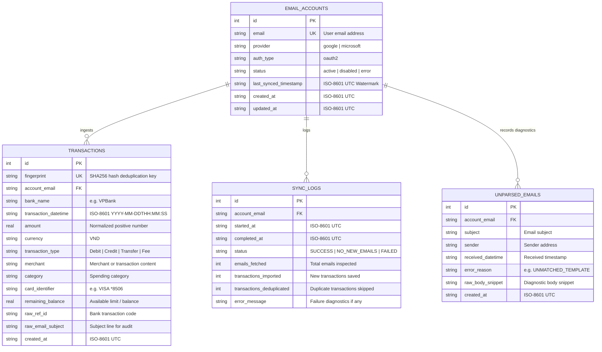
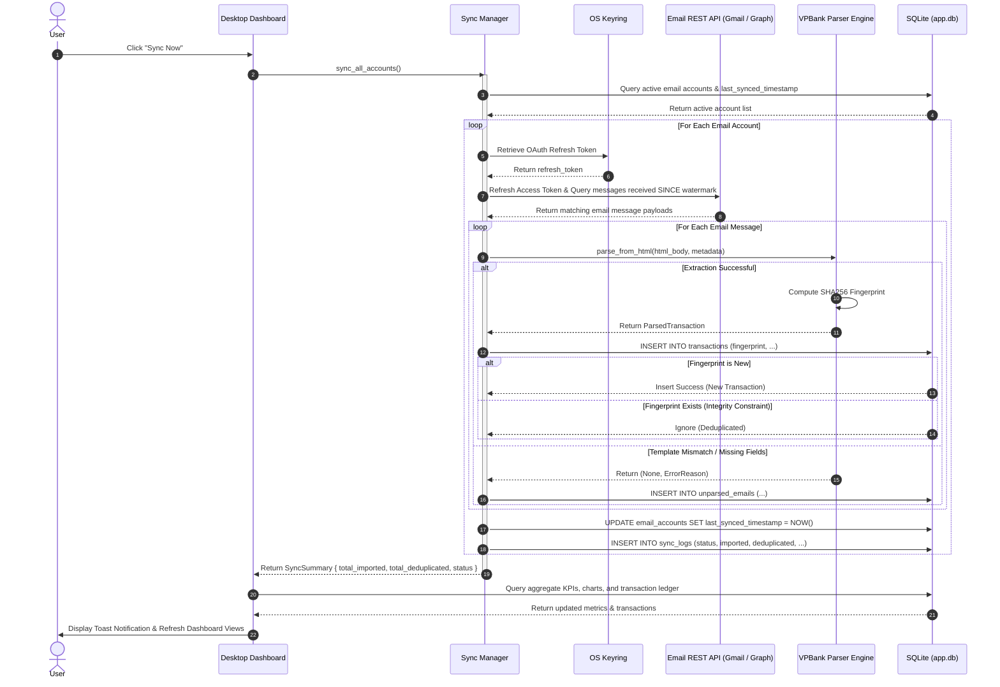

# System Architecture Specification

## 1. Executive Summary & Architectural Principles

The **Email Reader / Local Email Transaction Dashboard** is a **100% privacy-first, local-desktop personal finance application**. It automatically connects to a user's email accounts via **1-Click OAuth 2.0 (Google & Microsoft)**, extracts bank transaction notices (with VPBank as the baseline), and presents financial health metrics, spending trends, and transaction history in **VND** without routing any financial data through third-party servers or external AI cloud services.

### Key Architectural Principles
1. **Zero Privacy Leakage (Local-First)**: Direct client-to-provider connectivity; credentials, tokens, email contents, and financial transactions never leave the user's local machine.
2. **Strict Read-Only Scope Minimization**: Authorizations strictly require read-only email scopes (`gmail.readonly` and `Mail.Read`). No send, write, modify, or delete permissions are ever requested.
3. **OS-Level Secret Protection**: Sensitive OAuth refresh tokens are encrypted in the native operating system keyring (Windows Credential Manager / macOS Keychain / Linux Secret Service).
4. **Deterministic & Offline-Capable**: Transaction parsing relies on deterministic DOM and regex templates with SHA-256 fingerprint deduplication. Dashboard viewing, filtering, search, and recategorization operate 100% offline.
5. **Incremental Timestamp Watermarking**: Manual sync operations fetch only emails received strictly after the `last_synced_timestamp`, minimizing bandwidth and sync duration.

---

## 2. High-Level Architecture Diagram

```mermaid
graph TB
    subgraph Client Application [Local Desktop Client]
        subgraph Presentation Layer
            UI[React Desktop Dashboard<br/>KPI Cards | Charts | Ledger Table | Settings]
            CLI[CLI Tool<br/>Account & Sync Administration]
        end

        subgraph Service Layer
            AS[Account Service<br/>OAuth Lifecycle & Account Management]
            SS[Sync Service & Sync Manager<br/>Incremental Sync Orchestrator]
            KM[Keyring Manager<br/>OS Credential Vault Wrapper]
            PE[Parser Engine<br/>VPBank & Extensible Bank Parsers]
            CAT[Merchant Categorizer<br/>Rule-based Category Engine]
        end

        subgraph Data Layer
            DB[(Embedded SQLite DB<br/>app.db)]
            DB_Acc[(email_accounts)]
            DB_Tx[(transactions)]
            DB_Unp[(unparsed_emails)]
            DB_Log[(sync_logs)]
            
            DB --- DB_Acc
            DB --- DB_Tx
            DB --- DB_Unp
            DB --- DB_Log
        end
    end

    subgraph OS Security Subsystem
        OSKeyring[Native OS Keyring<br/>Windows DPAPI / macOS Keychain / Linux Secret Service]
    end

    subgraph External Email Providers [OAuth 2.0 Providers & REST APIs]
        GoogleOAuth[Google OAuth 2.0 & Gmail API<br/>Scope: gmail.readonly]
        MSGraph[Microsoft Identity & Graph API<br/>Scope: Mail.Read]
        SysBrowser[Default System Browser<br/>127.0.0.1 Loopback Callback]
    end

    %% Interactions
    UI --> AS
    UI --> SS
    CLI --> AS
    CLI --> SS

    AS --> KM
    AS --> GoogleOAuth
    AS --> MSGraph
    AS --> SysBrowser
    KM --> OSKeyring

    SS --> KM
    SS --> GoogleOAuth
    SS --> MSGraph
    SS --> PE
    PE --> CAT
    PE --> DB_Tx
    PE --> DB_Unp
    SS --> DB_Acc
    SS --> DB_Log

    UI --> DB
```

---

## 3. Layered Component Architecture

### 3.1. Presentation Layer
- **Desktop UI**: Built with React, TailwindCSS, Lucide Icons, and Recharts.
  - **KPI Header & Overview**: Shows Net Monthly Spending, Total Expense (Debit), Total Refunds/Income (Credit), and Active Accounts.
  - **Visualizations**: Monthly/Weekly spending trend curves, category allocation donut chart, and per-card spending distribution.
  - **Searchable Ledger Table**: Filterable by date range, merchant search, transaction type, category dropdown, and inline manual category reassignment.
  - **Account Settings Modal**: 1-Click "Connect with Google" and "Connect with Microsoft" buttons with real-time status and disconnect options.
- **CLI Interface (`src/cli.py`)**: Scriptable command-line interface for headless execution, automated ingestion, account diagnostics, and reporting.

### 3.2. Application & Service Layer
- **`OAuthService` (`src/auth/oauth_service.py`)**:
  - Implements OAuth 2.0 PKCE (RFC 7636) with SHA-256 code challenge generation and state verification.
  - Hosts a temporary loopback HTTP server on `127.0.0.1:<ephemeral_port>/callback` to capture authorization codes cleanly.
  - Handles token exchange and access token refreshes.
- **`AccountService` (`src/services/account_service.py`)**:
  - Manages account onboarding, connection testing, listing, and account revocation/disconnection without deleting historical ledger data.
- **`KeyringManager` (`src/security/keyring_manager.py`)**:
  - Encapsulates native OS credential operations under the `EmailReader` service namespace.
- **`SyncManager` (`src/sync/sync_manager.py`)**:
  - Coordinates multi-account synchronization.
  - Queries Google Gmail REST API (`after:<epoch>`) and Microsoft Graph API (`receivedDateTime ge <ISO>`).
  - Filters emails against bank sender allowlists (e.g. `@care.vpb.com.vn`, `@vpbank.com.vn`, `@techcombank.com.vn`, `@vietcombank.com.vn`, `@chase.com`).
- **`ParserEngine` & `VPBankParser` (`src/parser/vpbank_parser.py`)**:
  - Deterministic HTML DOM selector (`h5` + `p` bilingual labels) and regex extraction engine.
  - Normalizes amounts into positive numerical values in **VND** with Debit/Credit classification.
  - Computes deterministic SHA-256 fingerprint hashes for deduplication.
- **`Categorizer` (`src/parser/categorizer.py`)**:
  - Maps merchant keywords to standard spending categories (Transportation, E-Commerce, Subscriptions, Dining, Groceries, Healthcare, Travel, Utilities, Card Payments).

### 3.3. Persistence Layer (`src/db/database.py`)
- Embedded SQLite database (`app.db`) stored locally.



---

## 4. End-to-End Data Ingestion Pipeline



---

## 5. Security & Privacy Architecture

| Security Domain | Architectural Mechanism | Standard / Specification |
|---|---|---|
| **Authentication** | OAuth 2.0 PKCE (Proof Key for Code Exchange) with local loopback callback | RFC 7636 & RFC 8252 (OAuth for Native Apps) |
| **Credential Storage** | Encrypted native OS Keyring | Windows Credential Manager (DPAPI), macOS Keychain, Linux Secret Service |
| **Authorization Scope** | Strictly read-only email access | Google `gmail.readonly`, Microsoft `Mail.Read` |
| **Data Transit** | Direct HTTPS / TLS 1.3 connections between client machine and Google/Microsoft APIs | Zero third-party relay or proxy servers |
| **Local Data Storage** | Local embedded SQLite database on user's disk | No cloud synchronization or analytics telemetry |
| **Deduplication** | Cryptographic SHA-256 fingerprint hash collision prevention | Deterministic idempotency guarantee |

---

## 6. Technical Stack Summary

| Layer / Concern | Technology Selection | Rationale |
|---|---|---|
| **Runtime Environment** | Python 3.14+ / Node.js & React Desktop | Cross-platform, rapid execution, robust ecosystem |
| **Frontend UI** | React 19, TailwindCSS, Lucide Icons, Recharts | Interactive financial visualizations, responsive UI |
| **Authentication** | OAuth 2.0 PKCE, `requests`, `webbrowser`, local `http.server` | Official OAuth flow for native desktop clients |
| **Credential Vault** | `keyring` (Windows Credential Manager / Keychain) | Zero plain text secrets on disk |
| **Database** | Embedded SQLite 3 (`app.db`) | Zero-configuration, ACID compliant, embedded |
| **HTML Parsing Engine** | `beautifulsoup4`, `lxml`, regex | High-performance deterministic DOM extraction |
| **Test Automation** | `pytest`, `pytest-mock` | Automated unit, regression, and integration testing |
