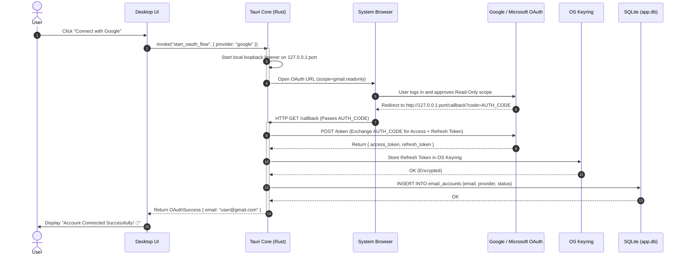
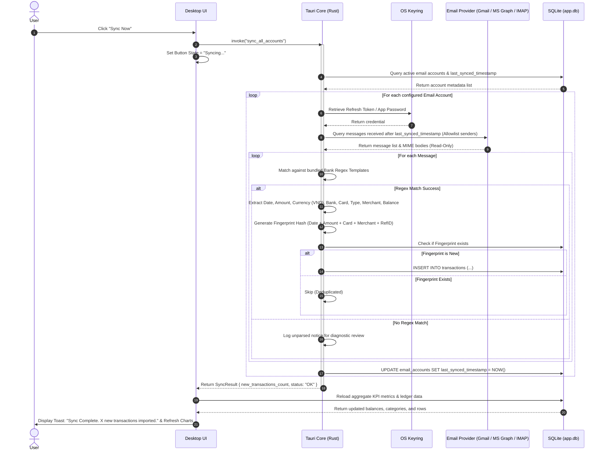

# Diagram: Email OAuth Authorization & Sync Pipeline

### Target Format: Mermaid (`.md`)
### Diagram Type: Sequence Diagram
### Target Path: `.agent-artifacts/requirements/output/epic-01-email-integration-sync/diagrams/diagram-email-sync-flow.md`

### Actors / Swimlanes
1. **User**: Local Application User
2. **Frontend**: React / Vite Desktop UI
3. **Backend**: Tauri (Rust) Core Engine
4. **Browser**: Default System Browser
5. **OAuth Provider**: Google / Microsoft OAuth 2.0 Endpoint
6. **OS Keyring**: Native OS Credential Storage (DPAPI / Keychain)
7. **Email API / IMAP**: Gmail REST API / MS Graph / IMAP Server
8. **SQLite DB**: Embedded Local Storage (`app.db`)

---

## 1. One-Click OAuth 2.0 Authorization Flow

---

## 2. Incremental Sync & Deterministic Parsing Flow

---

### Referenced Stories
- [us-001: Configure Email Accounts & Secure Credentials](../us-001-configure-email-accounts.md)
- [us-002: Manual Incremental Sync & Ingestion](../us-002-manual-incremental-sync.md)
- [us-003: Deterministic Transaction Extraction & Deduplication](../../epic-02-transaction-parsing-rules/us-003-deterministic-transaction-extraction.md)
- [us-004: Financial Overview KPIs & Spending Visualizations](../../epic-03-finance-dashboard-analytics/us-004-financial-overview-kpis-visualizations.md)
