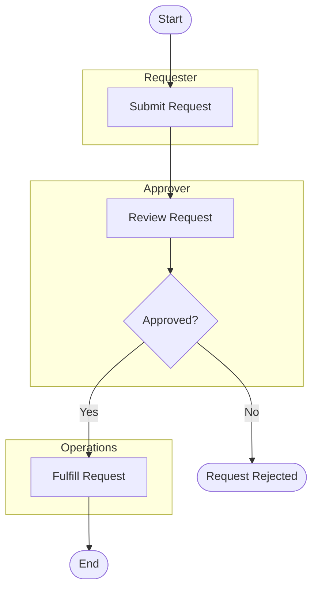
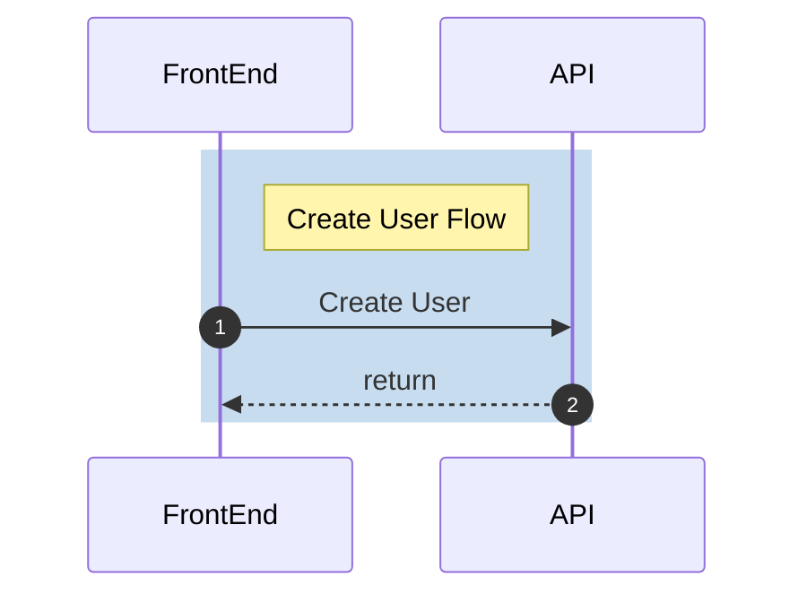

# Mermaid Diagram Guide

Use Mermaid for quick flowcharts, sequence diagrams, state diagrams, use cases, and ERDs.

## Output Rules

- Create Mermaid diagrams as Markdown files.
- Put the Mermaid diagram inside a fenced `mermaid` code block.
- Do not create `.mmd` files because VS Code natively previews Mermaid in Markdown files.
- Do not include headings or prose in Mermaid diagram files unless the user explicitly asks for explanatory Markdown.
- Keep labels short and business-readable.
- Use comments with `%%` only when they clarify a complex section.
- Do not use the literal `;` character anywhere inside Mermaid code. It breaks VS Code Mermaid preview. Use line breaks, commas, periods, colons, arrows, or other punctuation instead.
- Before delivery, scan the Mermaid code block for `;` and remove every occurrence.

## Flowcharts

- Start with `flowchart TD` for top-down flows or `flowchart LR` for left-to-right flows.
- Use rectangles for tasks, diamonds for decisions, and terminal nodes for start/end.
- Label decision branches with `|Yes|` and `|No|`.
- Prefer a single visible happy path with exception branches off to the side.
- For lightweight swimlanes, use one `subgraph` per role and place each activity in its responsible role. Use BPMN instead when formal lane semantics or BPMN gateways are required.

## Sequence Diagrams

- Start with `sequenceDiagram`.
- Use the same Markdown fenced block output rule as other Mermaid diagrams.
- Include `autonumber` by default.
- Use `->>` for requests and `-->>` for responses.
- Use `alt`, `opt`, and `loop` for conditional or repeated interactions.
- Use colored grouping boxes with `rect rgb(...)` or `rect rgba(...)` and `end` for logical flow sections when a sequence has multiple phases.
- Add a note label at the start of each grouped section, e.g. `note right of FrontEnd: Create User Flow`.
- Recommended grouping colors: light blue `rgb(200, 220, 240)`, light green `rgb(220, 240, 220)`, light yellow `rgb(255, 250, 205)`, light coral `rgb(240, 220, 220)`.
- Use `participant` for actors/systems, `Note over Participant: Text` for notes, `%%` for comments, and ` ` for line breaks.

## Other Mermaid Types

- State: use `stateDiagram-v2` for entity lifecycles.
- Use case: use Mermaid-compatible use case syntax only when supported by the target renderer; otherwise use a flowchart-style scope diagram.
- ERD: use `erDiagram`, include cardinality, and keep attributes to the level needed for the request.
