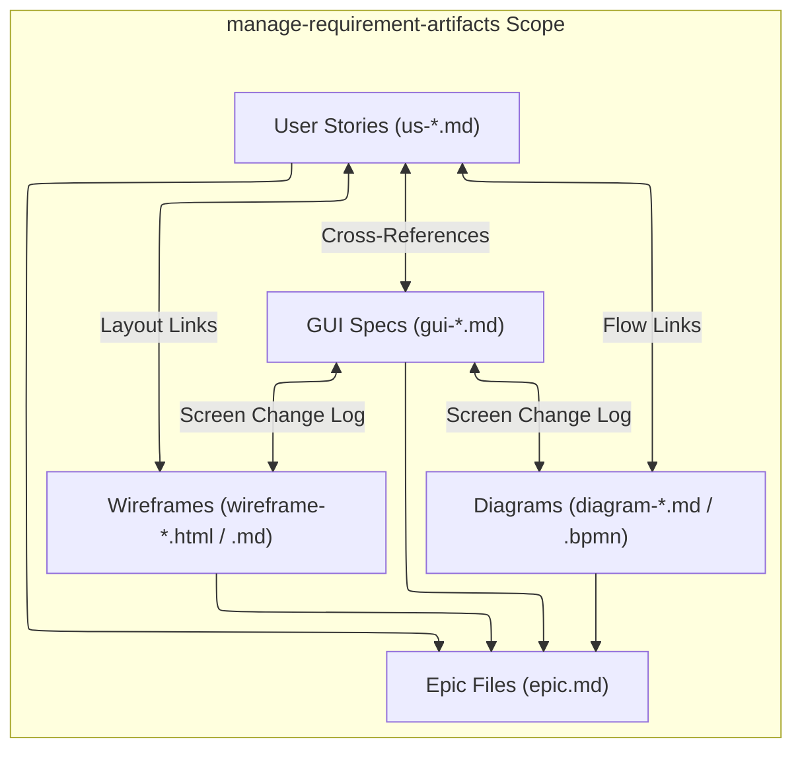

# Requirement Artifact Management Skill

## Purpose & Scope

Maintain `.agent-artifacts/requirements/` as the BA delivery workbench. Create backlog-ready user stories (`us-*.md`), implementation-ready GUI specifications (`gui-*.md`), and canonical epic files (`epic.md`).

This skill is the **Single Source of Truth (SSOT)** for deliverable placement and folder indexing rules under `.agent-artifacts/requirements/output/`.

---

## Artifact Traceability & Structure Scope

This diagram illustrates the artifact relationships and indexing structure managed within `.agent-artifacts/requirements/output/`:



### Incoming Handoffs:
- **From `ba-functional-decomposition` / `functional-decomposition.md`**: Reads `.agent-artifacts/requirements/output/functional-decomposition.md` to extract target `<epic-slug>` rows (story title, actor, user goal, slicing rationale), then authors `<epic-slug>/epic.md`, physical `us-*.md` user stories, and any needed `gui-*.md` screen specs — determining the GUI Spec CRUD Action itself, since the decomposition file does not carry GUI actions or links.
- **From `generate-wireframe`**: Receives rendered wireframe mockups $\rightarrow$ authors or updates cumulative `gui-<screen>.md` specifications and links them to user stories.
- **From `generate-diagram`**: Receives process/state flow diagrams $\rightarrow$ embeds diagram links into user story reference tables and GUI screen change logs.

### Outgoing Handoffs:
- **To `write-api-specification`**: When backend endpoint contracts or schemas are required.
- **To `generate-diagram`**: When visual workflow or state transition diagrams are required.
- **To `sync-backlog`**: When backlog-ready items are ready for Jira or Azure DevOps sprint synchronization.
- **To `update-project-knowledge`**: When stable domain concepts emerge to distill into `.agent-artifacts/project-knowledge-base/`.

---

## Ownership (SSOT for `.agent-artifacts/requirements/`)

This skill manages files within the canonical folder hierarchy:

```text
.agent-artifacts/requirements/
|-- index.md
|-- input/                          <-- Raw client intake, briefs, tickets, screenshots
|   `-- index.md
`-- output/                         <-- Canonical delivery hierarchy (using frontmatter status: draft / in-progress / authoritative)
    |-- index.md                    <-- Master index linking epics & root artifacts
    |-- vision-scope.md             <-- Overall product vision & scope
    |-- functional-decomposition.md <-- Overall capability breakdown
    |-- elicitation/                <-- Project-wide discovery notes & interview sessions
    |   |-- index.md
    |   `-- elicitation-<session-slug>.md
    `-- <epic-slug>/                <-- Epic delivery folder
      |-- epic.md                 <-- Canonical epic definition and child artifact links
        |-- elicitation-<session-slug>.md  <-- Epic discovery & Q&A notes
        |-- <user-story-id-or-slug>.md
        |-- gui-<screen-slug>.md
        |-- api-<api-slug>.md
        |-- wireframes/
        |   |-- wireframe-<screen-or-flow-slug>.html
        |   `-- wireframe-<screen-or-flow-slug>.md
        `-- diagrams/
            |-- diagram-<diagram-slug>.md
            `-- diagram-<diagram-slug>.bpmn
```

### Reference Guidelines & Templates
- **User Stories**: `assets/user-story-template.md` & `references/user-story-guidelines.md`
- **GUI Specs**: `assets/gui-specification-template.md` & `references/gui-specification-guidelines.md`
- **Epic Placement & Navigation**: `assets/epic-template.md` & `references/artifact-guidelines.md`

---

## Workflow

1. **Read Current State**:
   - Before drafting anything, read the target epic folder's current `epic.md`, its parent navigation index, and any existing `<user-story-id-or-slug>.md` / `gui-<screen-slug>.md` files, or confirm the epic folder does not exist yet for a brand-new epic.
   - For each confirmed slice, determine whether a matching story/GUI spec already exists (`UPDATE`) or not (`CREATE`), and note existing story IDs so new ones continue numbering without collision or renumbering.

2. **Consume Decomposed Slices**:
   - Read the target `<epic-slug>` section from `functional-decomposition.md` (or confirmed slicing handoff) to retrieve pre-sliced stories and actor goals. Determine GUI Spec CRUD actions and screen linkage yourself — they are not part of the decomposition file.

3. **Present Authoring Plan for Approval**:
   - Before creating, editing, or overwriting any file, contribute this skill's Epic, User Story, and GUI Specification rows to the orchestrator's combined artifact plan. The combined plan also carries Wireframe and Diagram rows owned by `generate-wireframe` and `generate-diagram`.

   | Artifact Type | Action | Owner | File Path | What Changes / Dependency |
   |---|---|---|---|---|
   | Epic \| User story \| GUI specification | `CREATE` \| `UPDATE` \| `NONE` | `manage-requirement-artifacts` | `<epic-slug>/<file>.md` | `<new epic / new story / new AC / new RAID row / new GUI component / supporting wireframe or diagram link, etc.>` |

   - Do not write any file until the user confirms the combined plan, or explicitly says to proceed without a separate confirmation step. Do not create a wireframe or diagram yourself; route those approved rows to their owning skills.

4. **Folder & Naming Conventions**:
   - Use stable lowercase hyphenated slugs (e.g., `epic-01-user-auth`, `us-001-customer-login.md`, `gui-order-detail.md`).
   - Place GUI specs, wireframes (`./wireframes/`), and diagrams (`./diagrams/`) in the same epic folder as their related user stories.

5. **Draft Artifacts with 3-Tier ACs, RAID Logs & UI Component Tables**:
   - Apply 3-tier Gherkin ACs and structured RAID logs for stories, and 4-column tables (`UI Element`, `Component Type`, `Description`, `Validation`) for GUI specs.

6. **Synchronize Navigation & Relative Links**:
   - Update the parent navigation `index.md` files and the relevant `epic.md`, ensuring all relative links resolve without dead paths.

---

## Artifact Boundaries

- **Owns**: Physical story authoring (`us-*.md`), GUI component tables (`gui-*.md`), screen change logs, and `.agent-artifacts/requirements/` folder indexing.
- **Does Not Own**: System/domain capability decomposition (owned by `ba-functional-decomposition`), endpoint schemas (`write-api-specification`), Mermaid/BPMN rendering (`generate-diagram`), or HTML mockups (`generate-wireframe`).
- Do not move deliverables to `.agent-artifacts/project-knowledge-base/` or edit raw files in `.agent-artifacts/requirements/input/`.
