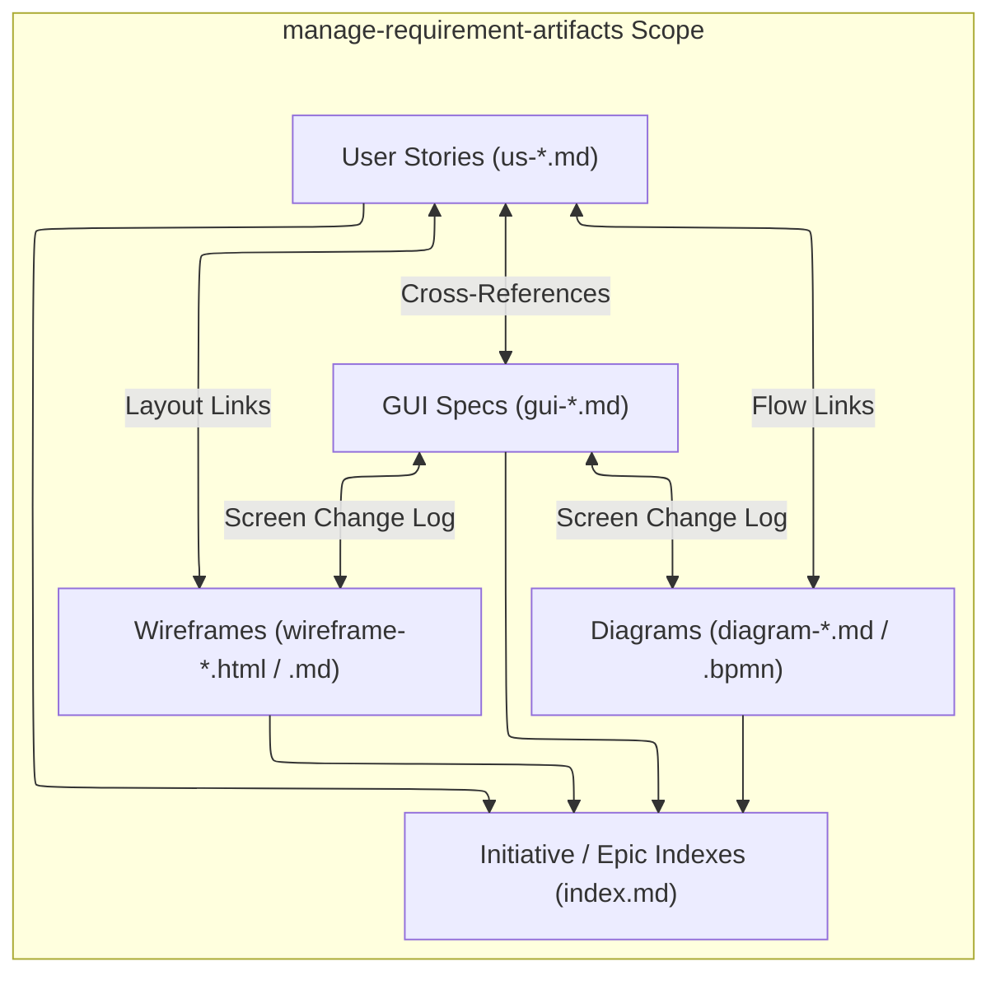

# Requirement Artifact Management Skill

## Purpose & Scope

Maintain `.agent-artifacts/requirements/` as the BA delivery workbench. Create backlog-ready user stories (`us-*.md`), implementation-ready GUI specifications (`gui-*.md`), and canonical initiative/epic folder indexes (`index.md`).

This skill is the **Single Source of Truth (SSOT)** for deliverable placement and folder indexing rules under `.agent-artifacts/requirements/output/`.

---

## Artifact Traceability & Structure Scope

This diagram illustrates the artifact relationships and indexing structure managed within `.agent-artifacts/requirements/output/`:



### Incoming Handoffs:
- **From `business-requirements-analyst`**: Receives confirmed slicing handoff payload (`target_initiative`, `target_epic`, `confirmed_slices`) $\rightarrow$ generates backlog-ready user stories (`us-*.md`), GUI specs (`gui-*.md`), and updates initiative/epic folder indexes.
- **From `generate-wireframe`**: Receives rendered wireframe mockups $\rightarrow$ authors or updates cumulative `gui-<screen>.md` specifications and links them to user stories.
- **From `generate-diagram`**: Receives process/state flow diagrams $\rightarrow$ embeds diagram links into user story reference tables and GUI screen change logs.

### Outgoing Handoffs:
- **To `write-api-specification`**: When backend endpoint contracts or schemas are required.
- **To `generate-diagram`**: When visual workflow or state transition diagrams are required.
- **To `sync-backlog`**: When backlog-ready items are ready for Jira or Azure DevOps sprint synchronization.
- **To `update-project-knowledge`**: When stable domain concepts emerge to distill into `.agent-artifacts/project-knowledge-base/`.

---

## Ownership (SSOT for `.agent-artifacts/requirements/`)

This skill manages files within the canonical folder hierarchy:

```text
.agent-artifacts/requirements/
|-- index.md
|-- input/                          <-- Raw client intake, briefs, tickets, screenshots
|   `-- index.md
|-- drafts/                         <-- Discovery workbench, session notes, candidate PRDs
|   |-- index.md
|   |-- elicitation/                <-- Elicitor interview records, PACT matrices, parking lots
|   |   `-- index.md
|   `-- candidate-specs/            <-- Pre-slicing draft PRDs, monolithic feature drafts
|       `-- index.md
`-- output/                         <-- Canonical delivery hierarchy (using frontmatter status)
    |-- index.md
    `-- initiatives/
        |-- index.md
        `-- <initiative-slug>/
            |-- index.md
            `-- epics/
                |-- index.md
                `-- <epic-slug>/
                    |-- index.md
                    |-- <user-story-id-or-slug>.md
                    |-- gui-<screen-slug>.md
                    |-- api-<api-slug>.md
                    |-- wireframes/
                    |   |-- wireframe-<screen-or-flow-slug>.html
                    |   `-- wireframe-<screen-or-flow-slug>.md
                    |-- diagrams/
                    |   |-- diagram-<diagram-slug>.md
                    |   `-- diagram-<diagram-slug>.bpmn
                    `-- analysis-<analysis-slug>.md
```

### Reference Guidelines & Templates
- **User Stories**: `assets/user-story-template.md` & `references/user-story-guidelines.md`
- **GUI Specs**: `assets/gui-specification-template.md` & `references/gui-specification-guidelines.md`
- **Scope Slicing**: `../analyze-requirements/references/slicing-guidelines.md`
- **Folder Placement & Indexing**: `assets/*-index-template.md` & `references/artifact-guidelines.md`

---

## Workflow

1. **Verify Confirmed Slicing Context**:
   - Confirm target initiative, epic, and story slice bounds ($\le 1$ week) before generating physical files.

2. **Folder & Naming Conventions**:
   - Use stable lowercase hyphenated slugs (e.g., `us-001-customer-login.md`, `gui-order-detail.md`).
   - Place GUI specs, wireframes (`./wireframes/`), and diagrams (`./diagrams/`) in the same epic folder as their related user stories.

3. **Draft Artifacts with 3-Tier ACs & UI Component Tables**:
   - Apply 3-tier Gherkin ACs for stories and 4-column tables (`UI Element`, `Component Type`, `Description`, `Validation`) for GUI specs.

4. **Synchronize Indexes & Relative Links**:
   - Update parent `index.md` files and ensure all relative links resolve without dead paths.

---

## Artifact Boundaries

- **Owns**: Story placement, GUI component tables, screen change logs, and `.agent-artifacts/requirements/` folder indexing.
- **Does Not Own**: Endpoint schemas (`write-api-specification`), Mermaid/BPMN rendering (`generate-diagram`), or HTML mockups (`generate-wireframe`).
- Do not move deliverables to `.agent-artifacts/project-knowledge-base/` or edit raw files in `.agent-artifacts/requirements/input/`.
